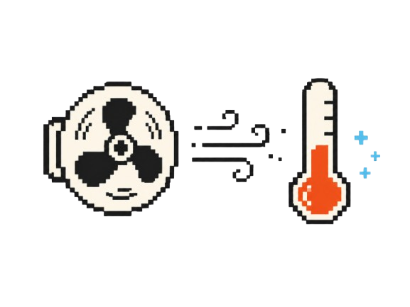
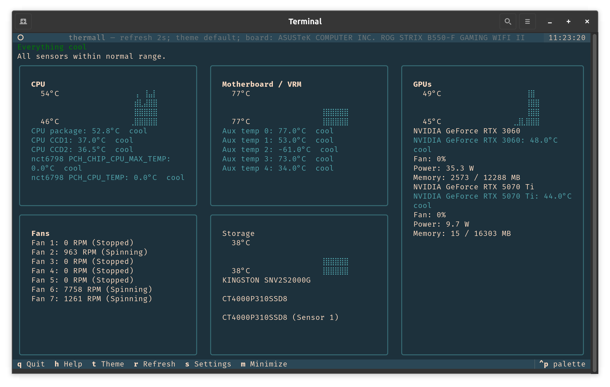
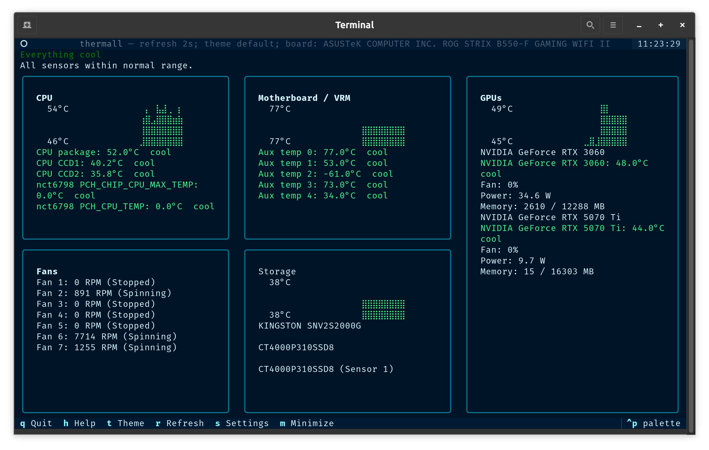
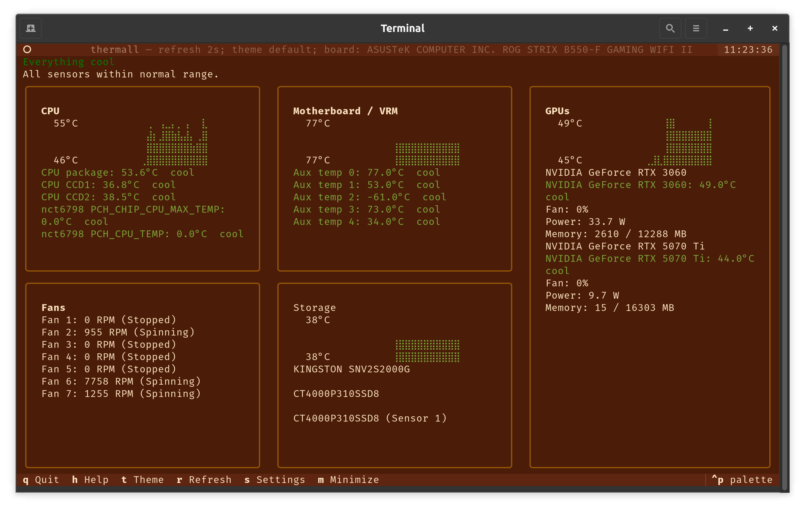
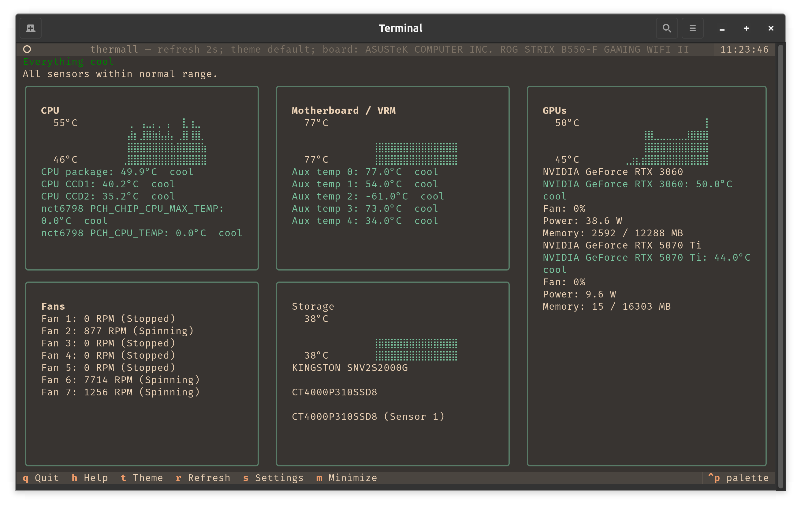
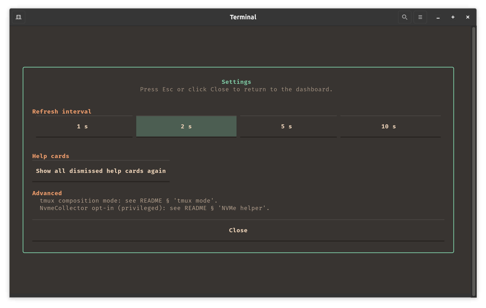
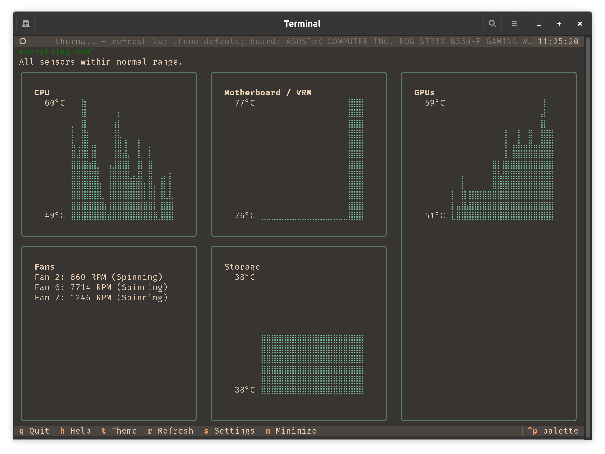

# thermall

<p align="center">
  
</p>

<p align="center">
  <a href="https://github.com/evoclock/thermall/actions/workflows/ci.yml"></a>
  <a href="LICENSE"></a>
  
</p>

Terminal UI dashboard for cooling-system observability on Linux. Answers the
question "is my cooling working as expected right now?" by showing fan RPMs,
motherboard sensors, CPU / GPU / NVMe temperatures, and threshold-graded
warnings in one screen.

## Why thermall

`btop` is excellent for general system load but does not surface fan RPMs or
motherboard-specific sensors (VRM, chipset, AUXTIN labels) in a useful way.
`nvtop` is excellent for per-GPU detail but is GPU-only. `sensors` and
`nvidia-smi` produce the raw data but require interpretation.

thermall fills the cooling-correlation niche. Fans and temperatures appear
together with human labels and threshold colour-grading so failure modes (a
dead chassis fan above a hot VRM, an NVMe heatsink fan stopped during sustained
I/O) are immediately visible.

## Screenshots

### Themes

| default | pacific northwest |
| --- | --- |
|  |  |
| **clay court** | **power station** |
|  |  |

### Settings and minimize





## Install

Requires Python 3.11 or newer.

```bash
pipx install git+https://github.com/evoclock/thermall.git
```

Upgrade: `pipx upgrade thermall`. Uninstall: `pipx uninstall thermall`.

A PyPI release is planned once the v1 surface is stable.

### Desktop launcher (optional)

After installing thermall, you can wire it into your desktop's
application menu:

```bash
thermall install-launcher
```

This writes a `.desktop` entry to `~/.local/share/applications/`
and 8 PNG icon sizes (16, 24, 32, 48, 64, 128, 256, 512) to
`~/.local/share/icons/hicolor/<size>x<size>/apps/thermall.png`,
letting the desktop environment pick the right size per surface
(dock, app launcher, alt-tab, file manager). Clicking the icon
opens thermall in a terminal. Remove with
`thermall install-launcher --uninstall`.

## Prerequisites

thermall installs cleanly via `pipx` and works with a useful default set
of panels as soon as `lm-sensors` and (if present) `nvidia-smi` are on
your system. The drive-health panel lights up when `smartmontools` is
installed and `smartd` is running. Nothing else is required.

### Required

1. `lm-sensors`: for CPU, NVMe composite temps, motherboard sensors, fans.

   ```bash
   sudo apt install lm-sensors           # Debian / Ubuntu
   sudo dnf install lm_sensors           # Fedora / RHEL
   sudo pacman -S lm_sensors             # Arch / Manjaro
   sudo sensors-detect                   # run once after install
   ```

2. `nvidia-smi`: for GPU panels. Comes with the NVIDIA driver. Only required if you have an NVIDIA GPU; the GPU panel disappears gracefully otherwise.

### Recommended

3. `smartmontools`: for drive-failure prediction. thermall reads
   `smartd`'s journal events; no privileged code in thermall itself.

   ```bash
   sudo apt install smartmontools && sudo systemctl enable --now smartmontools
   ```

   If `smartmontools` is missing, the drive-health panel says so and
   tells you what to install. Nothing breaks; you just don't get
   drive-failure warnings.

### Setup that may be required on some boards

4. `nct6775` kernel module: for motherboard fan / VRM / chassis-sensor
   visibility on Nuvoton-based boards (ASUS B550 / X570 and similar).
   thermall's first-run setup screen detects an absent module and
   surfaces the fix-up command:

   ```bash
   echo "nct6775" | sudo tee /etc/modules-load.d/nct6775.conf
   echo "options nct6775 force_id=0xd428" | sudo tee /etc/modprobe.d/nct6775.conf
   ```

   The `force_id` value varies by board. Cross-reference your
   manufacturer's support page or run `sudo dmidecode -t baseboard` to
   identify the chip.

### Advanced (optional, security trade-offs apply)

5. `nvme-cli` with a privilege grant: for live continuous NVMe SMART
   telemetry beyond what `smartd` reports as events. Off by default;
   never required. See "Drive health monitoring" section below for the
   three documented setup paths (`setcap`, helper service, polkit) and
   their security trade-offs.

## Usage

After `thermall install-launcher`, launch from your desktop's
application menu like any other app. From a terminal, run `thermall`.

For tmux users, a three-pane session with `btop` and `nvtop` alongside:

```bash
thermall --tmux
```

Keyboard shortcuts: `q` quit, `h` help overlay, `t` cycle themes,
`r` force refresh, `s` settings, `m` toggle minimize mode. The
footer mirrors the bindings and each entry is clickable.

The refresh interval is configurable from the settings modal (`s`)
at 1, 2, 5, or 10 seconds.

Minimize mode (`m`) hides per-sensor detail rows and stopped fans,
keeps panel headers + braille charts + spinning fans visible, and
expands the charts to 3x normal height so the freed space is used.

Terminals smaller than 90x28 show a "terminal too small" hint with
the live current / required dimensions instead of clipping panels
off-screen (btop-style).

## Drive health monitoring

thermall delegates drive-failure prediction to `smartmontools`. When
`smartd` is installed and running, thermall reads its event stream via
`journalctl` and renders a friendly status in the storage panel:

- "Drives healthy per smartd" (no warnings in the last 24 hours).
- "<drive>: <event message>" (the most recent event smartd logged,
  e.g. failed self-test, spare exhausted, percentage-used threshold).

This path uses no privileged code in thermall and is the recommended
setup for everyone. The privileged daemon (smartd) is maintained by
your distro and audited at that level.

### Live SMART telemetry (advanced, optional)

For users who want live continuous SMART data in the dashboard (per-sensor
temps that tick every refresh, percentage_used as a live number rather than
as a threshold-crossing event), thermall can also use `nvme smart-log`
directly. Off by default; never required.

`nvme smart-log` needs `CAP_SYS_ADMIN`, which is one of the most
powerful Linux capabilities. thermall ships one path for granting it
safely and mentions a second alternative for users who already manage
polkit. Other approaches (notably file-level `setcap`) are
intentionally not documented; see "What we do not recommend" below.

#### Helper service (recommended)

```bash
sudo thermall install-nvme-helper
```

Installs a small root-owned script that runs `nvme smart-log` on a
systemd timer and writes parsed JSON to a user-readable path. thermall
reads the JSON, never invokes `nvme` itself.

The systemd unit is hardened so even compromise of the helper script
cannot escalate: `NoNewPrivileges=yes`, `ProtectSystem=strict`,
`ProtectHome=yes`, `RestrictNamespaces=yes`,
`DeviceAllow=/dev/nvme* rw` only, `SystemCallFilter` limited to what
`nvme smart-log` actually needs. The blast radius is "the helper
script reading SMART", not "the entire `nvme-cli` surface area for
every local user."

Reversible with `sudo thermall install-nvme-helper --uninstall`.
Survives `nvme-cli` package upgrades because the privileged code is in
the helper, not on the nvme binary.

#### Polkit rule (alternative, for users who already manage polkit)

Configure polkit to allow only `nvme smart-log` for your user without
password. Most granular elevation; comparable safety to the helper
service. We do not ship templates for this path because polkit syntax
varies across distros and packaging; users who already run polkit
policies in their own systems can adapt the standard
`org.freedesktop.policykit.exec` rule pattern to scope the elevation to
this specific invocation.

#### What we do not recommend

**`sudo setcap 'cap_sys_admin+ep' "$(which nvme)"`** is a one-line
recipe widely posted online. We do not recommend it and we do not
document the setup path because granting `CAP_SYS_ADMIN` to the
`nvme` binary gives every local user (and any user-space code,
including malware in a compromised dependency) the ability to run
`nvme format` (irrecoverable data loss), `nvme fw-commit` (persistent
firmware compromise that survives OS reinstall), and `nvme read`
(raw block reads bypassing filesystem permissions). The capability
cannot be scoped to "only `smart-log`": Linux file capabilities apply
to the entire binary.

The helper service above achieves the same data access with a much
smaller blast radius. There is no scenario where setcap is the right
answer for thermall.

**If you previously enabled setcap on `nvme`** (from another guide or
from an earlier version of these docs), undo with:

```bash
sudo setcap -r "$(which nvme)"
```

#### If in doubt, do nothing

The default install (smartd via journal) covers the only NVMe-health
question most users actually care about: "is my drive starting to fail
or wear out?" smartd answers that. If you do not specifically need a
live percentage-used number ticking up in real time, you do not need
the helper or polkit at all.

## Configuration

Config lives at `~/.config/thermall/config.toml` (XDG-compliant). On first
run without a config, thermall auto-detects your hardware and proposes
sensible defaults; the first-run setup screen asks you to confirm. A
complete example ships at `config.example.toml` in the repository.

The config controls:

- Refresh cadence and active theme.
- Label mapping (raw kernel sensor name to human label, e.g. `AUXTIN0`
  to `"VRM (CPU)"`). Auto-populated on first run from a built-in
  per-board profile; editable if you want different names.
- Thresholds per sensor category (CPU, VRM, GPU, NVMe), used for green
  / amber / red colour-grading.

Most users never edit this file. The first-run setup screen handles
the common case. Advanced users can find sensor names with
`sensors -j` and add entries to `[labels]` to override the auto-detected
defaults.

## Themes

Four themes ship in v0.1.x; cycle through them at runtime with `t`.

- `default`
- `pacific-northwest`
- `clay-court`
- `power-station`

The active theme is recorded in `~/.config/thermall/config.toml` and
restored on next launch.

## Development

```bash
git clone https://github.com/evoclock/thermall.git
cd thermall
uv sync --all-extras
uv run pytest --cov=thermall --cov-fail-under=80
uv run ruff check .
uv run ruff format --check .
uv run mypy src/
```

## Acknowledgements

Built by Julen Gamboa with some agent-assisted spec-driven
development. Claude Code drove orchestration, design discussion, and
most of the implementation work; Hermes (using GPT-5.5 and Minimax
M2.5) handled additional review and asset generation. The agent
loop is held accountable to written design constraints in
`docs/design_rationale.md` rather than the other way around; every
implementation choice ties back to a written decision.

## License

MIT. See [LICENSE](LICENSE).
